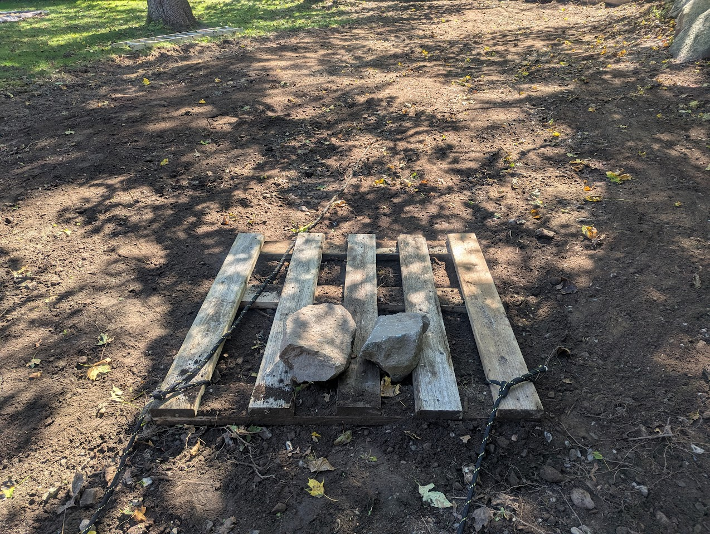

## About

Hi! My name is Andreas Olofsson and I am an electrical engineer living in Lexington, MA. For work, I spend most of my day on my laptop designing invisible electronic circuits to be manufactured in pristine semiconductor factories. In my spare time I enjoy running and getting my hands dirty working on hardware projects for my family. Below are some of the more fun projects I have worked on.

## Home Projects

### Treehouse (2016)

Building a tree house is such a fun and whimsical project. I built a few when I was a kid, but they weren't really very good. For my boys, I decided I was going to do it right. I went a bit overboard:-) Still, I am quite happy with how it turned out. I basically built a tiny house, complete with New England style shingles siding, proper roofing, windows, flower boxes, and insulation. (In retrospect, the insulation was a mistake that was only usd by squirrels for nesting.). My structural analysis was not very scientific, but the house is still standing strong ten years later and it definitely gets its fair share of compliments. I learned the lesson on worker safety the hard way...was working on the interior, took a step backwards and fell through the ladder opening. Ended up in the emergency room, but it all worked out ok. The tree house is now occupied by a large family of happy squirrels.

### Garage Makeover (2018)

The previous owner was a general contractor who had used the garage for lumber and equipment. It was a huge space, but a complete mess. To make better use of the space, I sub divided the garage into sections for different purpose. I created: 1.) a storage shed to hide away all my Parallella stuff (out of side, out of mind), 2.) shelves for storing all our sports equipment, 3.) an electronic workbench and component storage. These were simple projects that took about 1 weekend each.

### Garage Gym (2019)

To give a fun indoor space to hang out during the cold New England winders, I turned half the garage into an indoor gym. This turned out to be a life safer when Covid came around. The climbing wall was the most tedious project as it involved drilling and installing hundreds of climbing/mounting holes. Most of these projects were one weekend projects. The uses have evolved as the kids have grown up, but the gym has served us well. 

### Patio (2020)

This was covid time and like the rest of the US, we were going stir crazy at home. When we moved in, the back side of our house had an ugly chain link fence dog-run area. I removed that as soon as I could, but never got around to fixing a proper sitting area. This turned out to be a LOT of hard work. It was about a week of hard work, but the result was decent. Five years later, some of the tiles have settled a bit, so the lesson here is definitely to do a better job prepping the area. 

### Planter (2020)

Another simple covid era project. I am very thankul that we lived out in the suburbs for those awful years. There was a dead spot next to our greenhouse that had been been used as a parking space by the previous house owner. One trip to Home Depot and an order of soil, some help from the kids and we now have a nice planter spot for earthy projects. Over the years, we have grown potatoes, carrots, herbs, and flowers in that spot.

### Trampoline (2022)

A friend of my was moving out of his house and asked me if I wanted his in ground trampoline. Of course the answer was yes! All I had to do was did out the legs from his backyard. In then end, I basically ended up digging up the equivalent of a small swimming pool in my backyard. Yes, I could have rented an excavator, but then I wouldn't have had an excuse to sneak in shoveling workouts. My youngest son (the gymnast) ended up spending countless
hours doing flips on the trampoline, so all the digging was definitely worth it.

### Landscaping (2025)

Over the years, I had been using the back corner of our lot as a dumping ground for rocks, dirt (from the trampoline), leaves, fallen tree branches etc, and it was looking awful. This time, I wasn't in the mood for digging, so I rented an excavator. Well, per the book "you give a mouse a cookie", you give "an engineer an excavator", and he will look for things to do with it. A big lesson here was to finish everything you possible have while you have the big machine b/c once you are limited by your own power, things slow down by 100x. I ended up re-engineering our backyard, moving our driveway, moving tons of large boulders, and laying down sod. I started the project in september and everything had to get done before the winter/frost started so there was some time stress to this project. All in all, this was a ~6 week project with many 4-6 hour hard labour weekend days. Not intellecually hard, but definitely physically hard. At one point I pushed a bit hard and ended up injuring my back badly. The winter deadline was still in play, so I just loaded up with Advil and kept going. I can't tell you how much respect and sympathy I have for anybody doing this on a daily basis.

